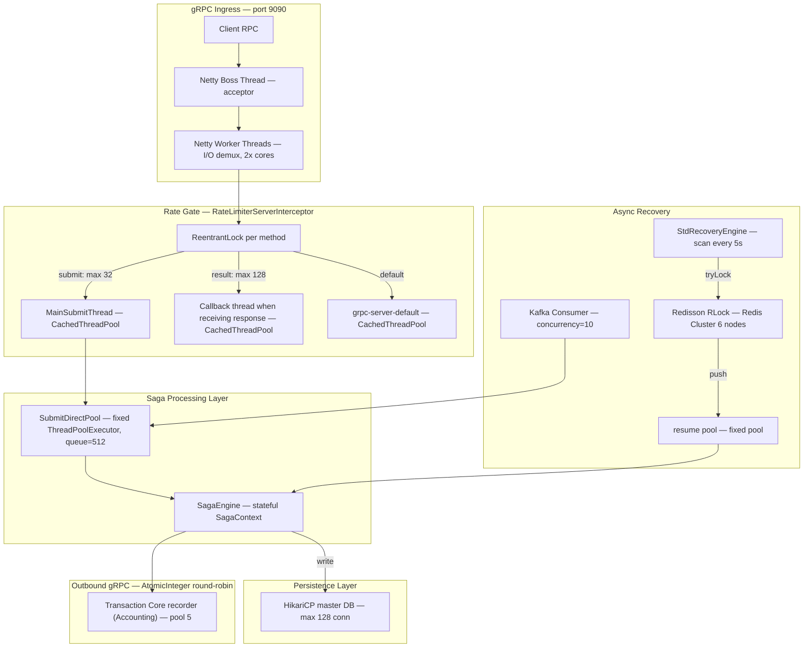

# ~ 1000+ Peak TPS (~ 86.4 millions records/ day) + 30 million users ->  Infrastructure Deep-dive report 


> **Runtime**: OpenJDK 17 (platform threads) | **gRPC**: Netty server


---

## 1. System Topology


---
Note:

1. Grpc Ingress = The frontdoor for GRPC calls

When a service (e.g a payment gateway)  wants to create a transaction to the system,it sends GRPC request ( which represent the HTTP/2 conn with probuf-encoded payload) to port 9090( normally). The grpc ingress mission:
+ Listen on port 9090 for incoming TCP connections
+ Only accepot the conn ( boss thread - 1 is enough)
+ Reads the bytes and decodes the grpc message ( worker thead - 2x core)
+ Hands off the decoded request to application logic 

2. I/O Demultiplexing 

which used to watch many conns at once and handle output to one core, reacting when ever is ready
So the idea is instead of having 1 thread per connection (which would be thousands of threads at scale), Netty uses the OS system call epoll (on Linux) to monitor thousands of TCP sockets simultaneously with a tiny number of threads:

```
epoll_wait([conn1, conn2, conn3, ... conn10000])
   → "conn47 has data ready"
   → read conn47's bytes
   → "conn312 has data ready"
   → read conn312's bytes
```

One Netty worker thread can handle hundreds of connections this way — it doesn't block waiting on any single connection, it just reacts to whichever is ready. That's demultiplexing: many inputs → one handler.

3. "2x cores" — Why That Number?

Netty's default worker group size is 2 × number of CPU cores. So on a 4-core pod:
```
Boss threads  = 1
Worker threads = 2 × 4 = 8
```
Why 2× instead of 1×? 

-> Because even though workers are mostly non-blocking, there's still a small CPU cost per connection (decode HTTP/2 frames, decompress protobuf). Having 2× cores gives headroom so workers don't queue up behind each other on a busy machine.

In short: "I/O demux, 2x cores" = 8 threads watching all incoming TCP connections via epoll, reacting to whichever socket has data, never blocking.

4. Why I choose 32 concurrency thread? 

Using Little's Law to reverse-engineer the reasoning, which states that the average number of items in a system ($L$) is equal to the average arrival rate ($\lambda$) multiplied by the average time an item spends in the system ($W$).

$$L = \lambda \times W$$

$L$ (Concurrency/Load): 32 concurrent requests (workers/threads).
$W$ (Latency): estimate acceptable 25ms ($0.025$ seconds).
$\lambda$ (Throughput): $32 / 0.025 = 1,280$ TPS.

So 32 was likely chosen to handle ~1,000–1,200 TPS with some headroom, while protecting the MySQL master DB from being flooded (32 writers at once is safe for most MySQL configs).


5. How to do when "burst buffer" ?

Imagine traffic suddenly spikes from 100 TPS to 500 TPS for 2 seconds:
```
Workers busy: all N workers occupied
Queue filling: 100... 200... 400... 512 tasks waiting
→ at 512: the Kafka listener thread (the caller) BLOCKS
→ Kafka stops consuming new messages
→ natural backpressure kicks in
```

The 512-slot queue absorbs short spikes instead of immediately blocking. It buys ~0.5–1 second of breathing room at high load before the system pushes back.

## 2. JVM Memory Model & Cgroup-Aware Heap Sizing
2.1. heap Sizing formula ( run.sh )

```
MAX_RAM=$((4 * 1024 * 1024 * 1024))                        # hard cap: 4 GiB
RAM=$(cat /sys/fs/cgroup/memory.max)                        # cgroupv2 (k8s 1.25+)
# fallback: /sys/fs/cgroup/memory/memory.limit_in_bytes    # cgroupv1
export XMX="$((memory * 75 / 100))m"   # 75% of cgroup limit → Xmx
export XMS=$XMX                         # Xms = Xmx → pre-commit full heap at startup
```

> [!IMPORTANT]
> `Xms = Xmx` means the JVM **pre-commits the full heap** to the OS at startup via `mmap(MAP_ANONYMOUS)`. This eliminates heap expansion pauses during traffic ramp-up but incurs an immediate RSS spike equal to `Xmx`. On k8s, the kubelet OOM killer sees this as full resident memory immediately, even if most pages are unaccessed (zero pages, CoW). This is correct behavior for a latency-sensitive financial service.


