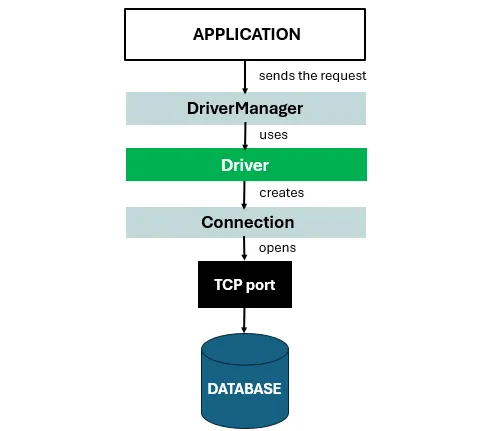

# 7. HikariCP — Connection Pool Mechanics Under Load

## 7.1 Internal Architecture

HikariCP uses `ConcurrentBag<PoolEntry>` — a lock-free, thread-local-aware borrow mechanism:

```
Thread A borrows conn:
  1. Check ThreadLocal list (O(1), no lock) → usually hits on hot paths
  2. If empty: scan shared bag CAS state IDLE → RESERVED
  3. If all busy: park on SynchronousQueue for `connectionTimeout=30s`
```

**Thread-local affinity** means the same DB thread tends to reuse the same physical MySQL connection, improving MySQL's query cache hit rate and reducing `COM_INIT_DB` roundtrips.

### 6.2 Connection Saturation Model

Master pool `maxPoolSize=128`, `minIdle=64`.

At peak load (1,000 TPS, avg query=8ms, P99=30ms):

```
Steady-state connections used  = 1000 × 0.008 = 8
P99 burst connections used     = 1000 × 0.030 = 30
P99.9 (assume 100ms)           = 1000 × 0.100 = 100   ← approaching limit
Saturation point               = 128 / 0.030  = 4,267 TPS possible (P99 limited)
```

**Saturation scenario**: MySQL GC pause of 500ms → `1000 × 0.500 = 500` connections needed → pool saturates at 128 → remaining 372 requests queue on `SynchronousQueue` for up to 30s → cascading timeout storm.

> [!Recommendation]
> There is no circuit breaker (Resilience4j) wrapping MySQL calls in this codebase. A MySQL availability event will hold gRPC threads at `HikariPool.getConnection()` for up to 30 seconds (`connectionTimeout`), silently holding the `RateLimiter` counter at max, blocking all new traffic from the rate gate. Recommend you to add `Resilience4j CircuitBreaker` on the repository layer or reducing `connectionTimeout` to 1–2s with explicit fallback.

### 6.3 DB Pool — Saturation Risk

```yaml
max-pool-size: 10
```

At 1,000 TPS with 3 bookkeeping writes per transaction (begin/commit/audit):
```
Effective bookkeeping TPS = 1000 × 3 = 3000 ops/sec
Avg write time = 5ms
Connections needed = 3000 × 0.005 = 15 > 10 (pool limit)
```

> [!Recommend]
> The db pool of 10 connections is **mathematically undersized** for 1,000 TPS if each transaction makes 3+ bookkeeping writes. Queueing on the this pool will occur. This is the highest-risk silent bottleneck under load testing.

