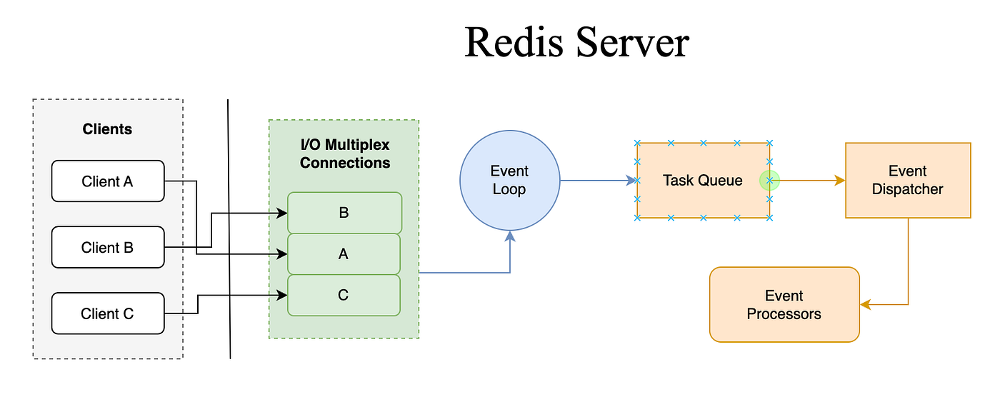

# 8. Redis / Redisson — Distributed Lock & Data Structure Internals



## 8.1 Redisson RLock Implementation (Recovery Engine)
```java
return client.getLock(key).tryLock(0, timeout.toMillis(), TimeUnit.MILLISECONDS);
//                                 ^waitTime=0 (non-blocking)
//                                          ^leaseTime = lockExpireInMs (60s)
```

Redisson `RLock` internals:
1. **Acquire**: executes a Lua script atomically on Redis:
   ```lua
   if redis.call('exists', KEYS[1]) == 0 then
     redis.call('hset', KEYS[1], ARGV[2], 1)
     redis.call('pexpire', KEYS[1], ARGV[1])
     return nil
   end
   ```
2. **Watchdog**: I set `leaseTime=60000ms` is explicit**, so **no watchdog** — the lock expires after 60 seconds regardless of the holder's liveness.


Note: when `waitTime > 0`, Redisson subscribes to a Redis pub/sub channel `redisson_lock__channel:{key}` to be notified on release. Here `waitTime=0` → immediate non-blocking return — no subscription overhead.

**Cross-pod behavior**: Both pods on `k8s-prod-1` and `k8s-prod-2` compete for the same `recoveryKey`. With `tryLock(waitTime=0)`, only one pod wins per 5-second scan interval. The losing pod logs nothing and skips — no retry storm.

## 7.2. RScoredSortedSet - Timeout Tracking Architecture

```java
futures[i] = sortedSet
    .entryRangeAsync(NEGATIVE_INFINITY, false, current, true, 0, count)
    // ZRANGEBYSCORE key -inf current LIMIT 0 count
```

16 Redis sorted sets (`bucketCount=16`) are queried in parallel (`CompletableFuture[]`). Each bucket holds transaction IDs scored by timeout epoch. The recovery scanner finds timed-out transactions via `ZRANGEBYSCORE`.

**Network round-trips per recovery scan cycle:**
- 16 `ZRANGEBYSCORE` (async, pipelined per bucket) → 1 RTT if same Redis shard handles all 16 keys
- Up to 16 `getBatch().execute()` for retry context → 1 RTT
- Up to 16 `ZADD` for timeout update → 1 RTT
- **Total**: 3–4 Redis RTTs per recovery scan, `~5ms` per cycle

**Redis Cluster hash slot distribution**: Keys are formatted as `{poolKey}:{bucketIndex}`. Since `poolKey` contains `{...}` hash tags -> retry keys for the same transaction are guaranteed to land on the same Redis hash slot → atomic batch operations work correctly.

## 7.3. Redisson vs Native Jedis - Netty thread model
7.3 Redisson vs. Native Jedis — Netty Thread Model
Redisson uses Netty as its network layer. The netty-threads: 16 in prod.yml controls Redisson's EventLoopGroup size (not Spring's server Netty). These 16 threads handle:

All async Redis command I/O (getAsync, setAsync, batch executes)
Pub/sub channel management
Watchdog heartbeats
At 1,000 TPS, if each transaction makes ~3 Redis ops (sorted set add, retry check, ACK):
```
Redis ops/sec = 3000
Avg Redis RTT = 2ms
Concurrent async ops in-flight = 3000 × 0.002 = 6 
```  
16 Netty threads for 6 concurrent ops → Could reduce to 4–8 for this workload.