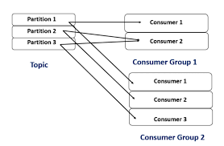

# 9. Consumer group mechanism

## 9.1 Consumer Group Mechanics



I just want to say, rebalance is not needed, Why do the healthy ones have to stop?

Spring Kafka's `ConcurrentMessageListenerContainer` with `concurrency=10` creates 10 `KafkaMessageListenerContainer` instances, each with its own:
- `KafkaConsumer` instance (not thread-safe, one per thread)
- Coordinator connection to a Kafka broker

The 10 consumers for the `submit` topic form a **consumer group** with group id `assetexchangev2`. Partition assignment is managed by the Kafka group coordinator via the **JoinGroup/SyncGroup** protocol.

**Critical parameter**: `max.poll.interval.ms` (default: 300,000ms = 5 minutes). If a consumer doesn't call `poll()` within 5 minutes, it's fenced from the group, triggering a **rebalance** that pauses all consumers in the group.

**Rebalance risk scenario**:
1. `DirectPool` queue is full (`arrayBlockingQueue.put()` blocks Kafka listener at `DirectPool`)
2. Kafka listener is blocked for > 5 minutes
3. Group coordinator fences the consumer → `REBALANCE_IN_PROGRESS` → all 10 consumers pause
4. All in-flight messages since last commit are redelivered (at-least-once semantics)

## 9.2. Consumer throughput analysis

Assuming 10 partitions (standard for this group size):
```
Per-partition throughput = total TPS / partitions = 1000 / 10 = 100 msg/sec per consumer
Avg processing time = saga Init + DB write ≈ 0.1s
Consumer thread utilization = 100 msg/sec × 0.1s = 10 (standard approach)
```