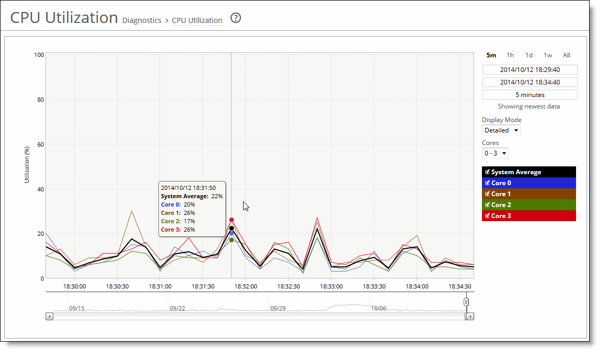

# 11. Resource Scaling Model
The formula is:



$  \text{CPU}_{\text{millicores}} = 1000 \times \left[ (\Phi \times W_{\text{cpu}}) + (N_{\text{ctx}} \times L_{\text{ctx}}) \right] \times (1 + \%GC)  $


+ The base calculation estimates CPU usage in cores (or fractional cores) by summing "processing" and "scheduling" components.
+ This is multiplied by 1000 to convert to millicores, a standard unit in Kubernetes for fine-grained CPU requests/limits (e.g., 500 millicores = 0.5 cores).
+ The entire estimate is then inflated by a factor of $  (1 + \%GC)  $, accounting for overhead from garbage collection (GC), which is common in managed languages like Python, Java, or Go.


Which come from three principal engineer: 

1. The Core: Queuing Theory (Little's Law)The part $(\Phi \times W_{cpu})$ is a direct application of Little's Law ($L = \lambda W$).In performance engineering, this is the "Utilization Law."It states that the number of resources (CPUs) needed is simply the rate of work arriving multiplied by the time it takes to process one unit of work.

2. The Overhead: "Mechanical Sympathy"The $(\underbrace{N_{ctx} \times L_{ctx}}_{Scheduling})$ part comes from the school of High-Performance Computing (HPC), popularized by engineers like Martin Thompson (the creator of the LMAX Disruptor you asked about!).Traditional computer science often ignores context switching as "negligible."Modern performance modeling "Mechanical Sympathy" explicitly adds this "Tax." It recognizes that the CPU isn't just working on your code; it’s working on the management of your code (swapping threads, clearing caches).

3. The "Java Tax": Garbage Collection ModelingThe final $\times (1 + \%GC)$ is a standard JVM Performance Tuning heuristic.Since G1GC or ZGC runs concurrently with your application, it "steals" cycles.If you have a 10% GC overhead, your application effectively needs 1.1x the calculated CPU to maintain the same throughput because the CPU is "absent" from your code 10% of the time.

### Resource Scaling Table

| Load (TPS) | Active Threads | Heap Live (est.) | Master DB Conns | Kafka Lag Risk | CPU Request | Memory Limit |
|---|---|---|---|---|---|---|
| 100 | ~60 | ~300MB | ~1 | None | 200m | 2GiB |
| 300 | ~100 | ~600MB | ~3 | None | 400m | 2GiB |
| 500 | ~150 | ~900MB | ~8 | Low | 700m | 3GiB |
| **1,000** | **~250** | **~1.4GB** | **~15** | **Medium** | **1.2 cores** | **3GiB** |
| 1,500 | ~280 (gated) | ~1.8GB | ~25 | High | 1.6 cores | 4GiB |
| **2,000** | **~300 (capped)** | **~2.0GB** | **~30** | **Critical** | **2.0 cores** | **4GiB** |
| 3,000 | 300 (hard wall) | OOM risk | ~45 | Rebalance | > 2 cores | Scale out |

### Horizontal Pod Scaling Recommendation

Given gRPC rate limit hard-caps (submit=32, result=128), **vertical scaling has diminishing returns** above 1 pod. Recommended minimum:

```
Pods = ceil(TPS_target / TPS_per_pod)
TPS_per_pod bottleneck = min(
  submit_concurrency / avg_submit_latency,   = 32 / 0.025 = 1,280 TPS
  DB_pool / avg_db_time,                     = 128 / 0.008 = 16,000 TPS
  bookkeeping_pool / avg_book_time           = 10 / 0.005 = 2,000 TPS [BINDING]
)
→ TPS_per_pod ≈ 1,280 TPS (submit rate limiter is binding)
→ For 5,000 TPS target: ceil(5000/1280) = 4 pods minimum