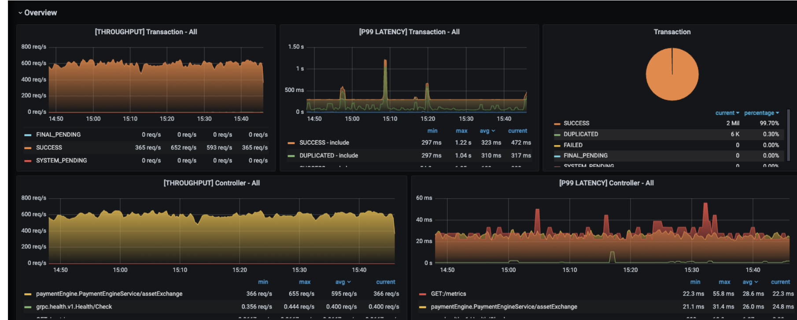
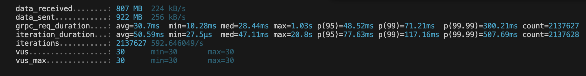
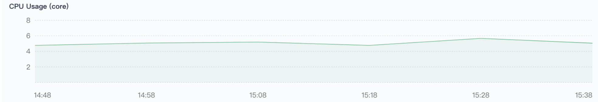
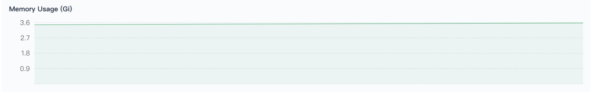
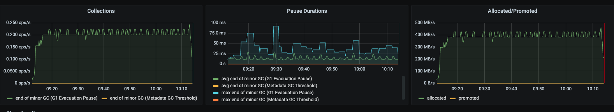
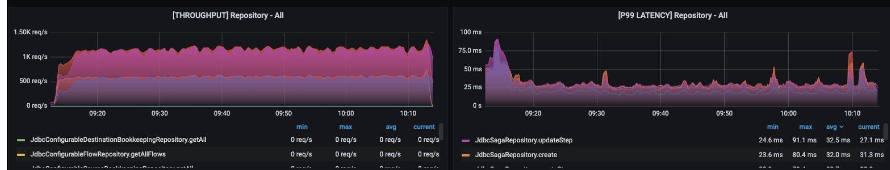
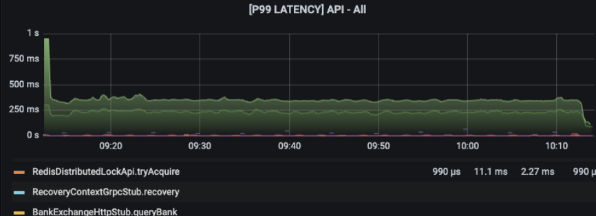
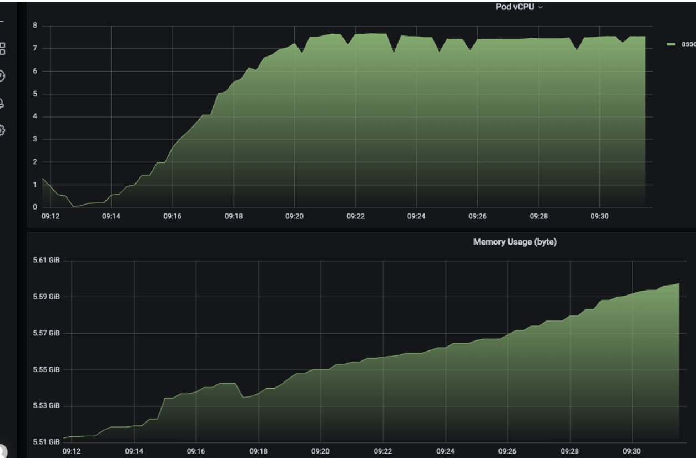

# ~ 1000+ Peak TPS (~ 86.4 millions records/ day) + 30 million users ->  Infrastructure Deep-dive Builder

> **Runtime**: OpenJDK 17 (platform threads) | **gRPC**: Netty server

## 1. Capacity
Results:
  + Throughput: Achieved a consistent throughput of more than 500 transactions per second (TPS) - per pod.
  + Latency: Maintained an average latency less than 30 milliseconds (ms) avg per transaction.
  + Success rate: The success rate is 100% (include duplicated transaction) with no transaction is failed.

<figure align ="center">

<figcaption>
 Throughput, status of transaction, p99 latency metrics of a single pod
</figcaption>
</figure>

<figure align ="center">

<figcaption>
K6 performance metrics: avg, min, med, max, p95, p99, p99.99
</figcaption>
</figure>

## 2. Stability of system
Objective: Ensure the transaction engine maintains stable performance over extended periods.

Results:

+ Throughput Stability: Throughput average is more than 500 req/s with the maximum is over 600 req/s. (Image 1 & 2)
+ Latency Stability: Latency variance remained within only ±10 ms of the average latency. (Image 1 & 2)

## 3. Stability of jvm
Objective: Verify the stability of the JVM and system resource usage.

Results:

+ CPU Usage: CPU usage is remaining stable average is aroudn 5 virtual CPU ~ 5000 milicores, with peaks up to approximately 6 virtual CPU.

+ Memory Usage: Heap memory usage average is 2.88Gib, which fluctuate only ± 0.06 Gib. 

+ JVM Stability: No garbage collection (GC) pauses exceeding 50 ms. 

<figure align="center">
  
  
  <figcaption>CPU and memory usage</figcaption>
</figure>

Deep dive into JVM. The importance is undisputable.
<figure align="center">
  
  <figcaption>JVM garbage collection</figcaption>
</figure>

## 4. Database connection pool
<figure align="center">
  
  <figcaption>Throughput and latency of database</figcaption>
</figure>

## 5. Redis distributed locking 
<figure align="center">
  
  <figcaption>Throughput and latency of database</figcaption>
</figure>

## 6. CPU and RAM usage
<figure align="center">
  
  <figcaption>CPU and RAM usage</figcaption>
</figure>

## 7. System Correctness & Transactional Integrity Validation

Objective: To ensure the transaction engine maintains strict data integrity under high-load scenarios.

Methodology: Utilized generative testing with randomized operations to validate business logic against expected outcomes.

Test Scenario (Account-to-Account Transfer):
+ Setup: Initialized two Master Accounts (Account A and Account B) with multiple sub-accounts.

+ Execution: Simulated concurrent transfers of a fixed amount ($X$) using Y Virtual Users (VUs) via the Transaction Engine.

+ Verification: Performed real-time balance checks on all sub-accounts post-transfer.

Key Result: Successfully asserted that the combined sum of all accounts remained identical before and after the load test, proving zero "leakage" or double-spending in the system.